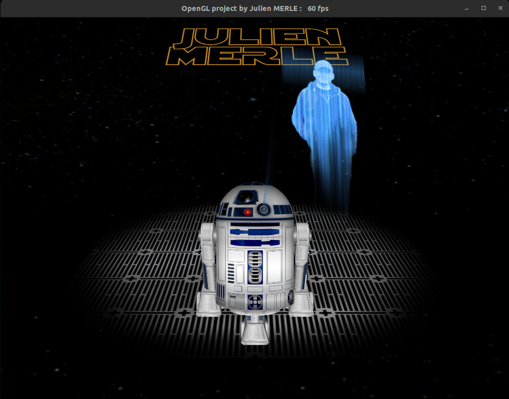

# 3DROID



## Description
This OpenGL demo offers you to play with a 3D animated droid inspired by a popular movie character. The scene is fully made from C++ lines of code without any imported 3D model.

## Droid control keys :
- Z Q S D : move the droid in any direction
- F : turn on / off hologram
- R : enable / disable head animation
- A or E : rotate the head to the left / right

## Camera settings :
- V : change camera view mode
- Click + mouse move : orientate camera
- Mouse wheel or -  + keys : zoom in / out

## Scene attributes :
- M : enable / disable music
- T : change render mode
- Y : change quality settings
- O : enable / disable textures
- Return : reset scene

## Navigation
- Space : show / hide this helper
- ESC : exit

## Compilation
```
g++ Main.cpp Audio.cpp Robot.cpp Event.cpp Mesh.cpp Img.cpp Environment.cpp Texture.cpp Vertex.cpp -o run -lm -lGL -lglut -lGLU
```

May the force be with you ! :)